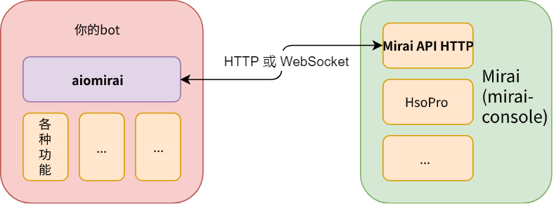

# 概览

:::tip 提示
如果在阅读本文档时遇到难以理解的词汇, 请随时查阅 [Mirai API HTTP 的文档](https://github.com/mamoe/mirai-api-http) 或使用 [Google 搜索](https://www.google.com/).
:::

:::tip 提示
初次使用时可能会觉得这里的概览过于枯燥, 可以先简单略读之后直接前往 [安装](./installation.md) 查看安装方法, 并进行后续的基础使用教程.
:::

[`Mirai`](https://github.com/mamoe/mirai) 是一款优秀的高性能 QQ(也称OICQ) 无头客户端兼框架, 基于一种被称作 Kotlin 的 JVM 方言开发, 向机器人开发者提供了友好, 强大的应用接口, 且同时提供 `mirai-native`, `mirai-http-api`, `mirai-japt` 等运作高效的工具链, 用于对所有编程语言提供支持.

[`Mirai API HTTP`](https://github.com/mamoe/mirai-api-http) 是一个用于 [mirai-console](https://github.com/mamoe/mirai-console) 的插件, 提供HTTP API, 供所有语言使用 mirai.

[`Async Mirai SDK for Python`](https://github.com/AsakuraMizu/aiomirai)(aiomirai) 是基于 `mirai-http-api` 开发的面向 Python 开发者的机器人框架, 使用 asyncio, httpx, quart(用于通过 HTTP POST 上报事件) 等作为底层实现编写而成.

本文档是 `Async Mirai SDK for Python` 的实践和技术参考, 若你对其中的内容感到困惑, 欢迎你协助我们完善. 文档使用了 [`koishi.github.io`](https://github.com/koishijs/koishijs.github.io) 中的 vue 组件, 部分内容参考了 [`python-mirai`的说明文档](https://mirai-py.originpages.com/) 以及 [`NoneBot`的说明文档](https://nonebot.cqp.moe/).

## 它如何工作？

`aiomirai` 的运行离不开 `Mirai` 和 `Mirai API HTTP` 插件. `Mirai` 扮演着「无头 QQ 客户端」的角色, 它进行实际的消息、通知、请求的接收和发送, 通过其内部机制与 `Mirai API HTTP` 插件交互, `aiomirai` 则负责与 `Mirai API HTTP` 插件通过 HTTP 的方式交互.

### API

类似 CQHTTP Python Async SDK, 我们封装了统一的 API 调用方法 [`call_action`](../api.md), 然后我们定义了 `__getattr__` 魔术方法, 从而你可以使用 `api.send_group_message(xxx)` 的方式调用 [`sendGroupMessage`](https://github.com/mamoe/mirai-api-http#%E5%8F%91%E9%80%81%E7%BE%A4%E6%B6%88%E6%81%AF). 

对于特殊的 API (例如 `auth`, `verify`, `upload_image`, `(GET)config` 等等), 我们单独进行了编写, 使用 `Mirai API HTTP` 文档中所规定的方法调用 API.

值得一提的是, 除 `auth` 方法外, 其余所有对 API 的调用都是通过 `call_action` 方法进行的, 所以你可以通过继承 `Api` 类或 `SessionApi` 类并重载 `call_action` 方法的方式, 实现更为高级的功能(例如`auto (re)auth&verify`)

### 事件

`Mirai API HTTP` 插件支持 `WebSocket`, `HTTP Polling` 和 `HTTP POST` 上报三种事件监听方式, `aiomirai` 对这几种方法都进行了支持(注意: 截止到本文档编写时, 仅有 `HTTP POST` 上报已编写完成, 其余两种方式仍在编写中)

## 示意图

